# git-dispatch

Split a source branch into stacked task branches. Keep them in sync bidirectionally. Never cherry-pick manually again.

## Problem

You write a TRD, vibe-code the whole feature on a source branch, then need clean stacked PRs for review. Manually cherry-picking and keeping branches in sync is tedious and error-prone.

## Solution

Tag commits with `Task-Id` trailers. `git dispatch split` groups them into stacked branches. `git dispatch sync` keeps everything in sync both ways.

## Quick Start

```bash
# Install
curl -fsSL https://raw.githubusercontent.com/KakkoiDev/git-dispatch/master/install-remote.sh | bash

# Tag commits on your source branch
git checkout -b source/feature master
git commit -m "Add PurchaseOrder to enum" --trailer "Task-Id=3"
git commit -m "Create GET endpoint"       --trailer "Task-Id=4"
git commit -m "Add DTOs"                  --trailer "Task-Id=4"
git commit -m "Implement validation"      --trailer "Task-Id=5"

# Split into stacked branches
git dispatch split source/feature --base master --name feat/feature
# master
# └── feat/feature/3
#     └── feat/feature/4
#         └── feat/feature/5

# Continue working, then sync (auto-detects source from current branch)
git dispatch sync
```

## Pipeline Overview

```mermaid
flowchart LR
    TRD["📄 TRD\n(Task numbers)"]
    SRC["🔀 Source Branch\n(tagged commits)"]
    STK["📚 Stacked Branches\n(one per task)"]
    PRs["🔗 Stacked PRs\n(chained bases)"]

    TRD -- "vibe-code" --> SRC
    SRC -- "split" --> STK
    STK -- "push + pr" --> PRs

    STK -- "sync" --> SRC
    SRC -- "sync" --> STK
```



## Commands

| Command | Description |
|---------|-------------|
| `git dispatch split <source> --name <prefix> --base <base>` | Split source into stacked branches by Task-Id |
| `git dispatch split <source> --name <prefix> --dry-run` | Preview split without creating branches |
| `git dispatch sync` | Auto-detect source, sync all task branches bidirectionally |
| `git dispatch sync [source]` | Sync all task branches for a specific source |
| `git dispatch sync [source] <task>` | Sync one specific task branch |
| `git dispatch status [source]` | Show pending sync counts without applying |
| `git dispatch push [source] [--branch <name>] [--force] [--dry-run]` | Push task branches to origin |
| `git dispatch pr [source] [--branch <name>] [--title <t>] [--body <b>] [--push] [--dry-run]` | Create stacked PRs via gh CLI |
| `git dispatch resolve` | Convert merge commit on task branch to regular commit with Task-Id |
| `git dispatch restack [source] [--dry-run]` | Rebase stack onto updated base after merge |
| `git dispatch reset [source] [--branches] [--force]` | Clean up dispatch metadata |
| `git dispatch tree [branch]` | Show stack hierarchy |
| `git dispatch hook install` | Install hooks (auto-carry Task-Id + enforce Task-Id) |
| `git dispatch help` | Show usage guide |

## Task-Id Trailers

Commits use native git trailers for task linking:

```bash
git commit -m "Add feature" --trailer "Task-Id=3"
```

Parse trailers (zero regex, git-native):

```bash
git log --format="%H %(trailers:key=Task-Id,valueonly)" master..source
```

Install the hook to enforce trailers on every commit:

```bash
git dispatch hook install
```

## Task-Order Trailer

Optional trailer to control stack position during split:

```bash
git commit -m "fix" --trailer "Task-Id=task-13.1" --trailer "Task-Order=8"
```

By default, tasks are ordered by first commit appearance. `Task-Order` gives explicit control:
- Tasks with `Task-Order` sort first (ascending by value)
- Tasks without `Task-Order` follow in commit order
- Duplicate `Task-Order` values are rejected

Useful when a late fix for an earlier task needs to stay near its parent in the stack.

## Example: TRD to Stacked PRs

The full workflow starts with a TRD (Technical Refinement Document). Task numbers in the TRD become `Task-Id` trailers in commits, which become stacked branches and PRs.

See [`trd-template.md`](trd-template.md) for the full template.

### The TRD

```markdown
# TRD - Purchase Order Transaction Registration

## Tasks

### Part 1 - Backend Infrastructure
#### 3. (Schema) Add PurchaseOrder to TransactionLineSource enum
#### 4. (BE) Create GET /transactions/by-purchase-order/:id endpoint
#### 5. (BE) Implement Purchase Order validation in transaction service

### Part 2 - Frontend
#### 9. (FE) Add transaction status to PO Detail header
#### 10. (FE) Add menu item with confirmation dialog
#### 11. (FE) Create transaction registration page
```

### Step 1: Vibe-code the source

Code the whole feature on one branch. Tag every commit with its TRD task number:

```bash
git checkout -b cyril/source/po-transactions master
git dispatch hook install

# Task 3 - Schema
git commit -m "Add PurchaseOrder to TransactionLineSource enum" --trailer "Task-Id=3"

# Task 4 - GET endpoint
git commit -m "Create DTOs for purchase order transaction"      --trailer "Task-Id=4"
git commit -m "Add controller and service methods"              --trailer "Task-Id=4"
git commit -m "Add tax mapping logic for debit side"            --trailer "Task-Id=4"

# Task 5 - Validation
git commit -m "Implement PO validation in transaction service"  --trailer "Task-Id=5"
git commit -m "Add optimistic locking and permission checks"    --trailer "Task-Id=5"

# Task 9 - FE status header
git commit -m "Add transaction status to PO detail header"      --trailer "Task-Id=9"

# Task 10 - FE menu item
git commit -m "Add menu item with confirmation dialog"          --trailer "Task-Id=10"
```

The source branch is demo-able. Show it to PM, get feedback, iterate.

### Step 2: Split into stacked branches

```bash
# Preview first
git dispatch split cyril/source/po-transactions \
  --base master --name cyril/feat/po-transactions --dry-run

# Split
git dispatch split cyril/source/po-transactions \
  --base master --name cyril/feat/po-transactions
```

Result:
```
master
└── cyril/feat/po-transactions/3   (1 commit)
    └── cyril/feat/po-transactions/4   (3 commits)
        └── cyril/feat/po-transactions/5   (2 commits)
            └── cyril/feat/po-transactions/9   (1 commit)
                └── cyril/feat/po-transactions/10  (1 commit)
```

Each branch contains only its task's commits, stacked on top of the previous task. Reviewer reads one branch = one TRD task.

### Step 3: Create stacked PRs

```bash
# Preview what would be created
git dispatch pr --dry-run

# Push branches and create PRs
git dispatch pr --push
```

### Step 4: Keep iterating

Fix something on the source? Sync pushes it to the right task:

```bash
git checkout cyril/source/po-transactions
git commit -m "Fix tax mapping edge case" --trailer "Task-Id=4"
git dispatch sync
```

Fix something on a task branch? Sync pushes it back to source:

```bash
git checkout cyril/feat/po-transactions/5
git commit -m "Fix permission check"
git dispatch sync
# Task-Id=5 trailer added automatically, synced back to source
```

Source stays demo-able. PRs stay clean. Reviewer reads commit-by-commit.

## Commands Reference

### split

```bash
git dispatch split <source> --name <prefix> [--base <base>] [--dry-run]
```

Parse `Task-Id` trailers from source, group commits by task, create stacked branches named `<prefix>/<task-id>`. Each branch stacks on the previous.


After `split`:


### sync

```bash
git dispatch sync                    # auto-detect source, sync all
git dispatch sync [source]           # explicit source, sync all
git dispatch sync [source] <task>    # sync one task
```

Bidirectional sync using `git cherry` (patch-id comparison). Source->task: new commits for the task appear in the task branch. Task->source: fixes flow back (Task-Id trailer added if missing). Auto-detects source from current branch context.

```mermaid
flowchart LR
    subgraph "Source → Task"
        S1["source: new commit\n[Task-Id=4]"] -- "cherry-pick" --> T1["task/4"]
    end

    subgraph "Task → Source"
        T2["task/4: fix commit"] -- "cherry-pick\n(Task-Id added)" --> S2["source"]
    end
```



### status

```bash
git dispatch status              # auto-detect source
git dispatch status [source]     # explicit source
```

Show pending sync counts per task branch without applying changes. Quick preview before running `sync`.

### push

```bash
git dispatch push                # auto-detect source, push all task branches
git dispatch push [source]       # explicit source
git dispatch push --branch feat/4        # push a single branch
git dispatch push --force        # force push after sync (uses --force-with-lease)
git dispatch push --dry-run      # show what would be pushed
```

Push task branches to origin with upstream tracking (`-u`). Walks the dispatch stack in order. `--branch` targets a single branch instead of all tasks. `--force` uses `--force-with-lease` for safe force-push after sync rewrites history.

### pr

```bash
git dispatch pr                  # auto-detect, create all PRs
git dispatch pr [source]         # explicit source
git dispatch pr --branch feat/4        # target a single branch
git dispatch pr --title "My PR" --body "Description"  # custom title/body
git dispatch pr --push           # push branches first, then create PRs
git dispatch pr --dry-run        # show what would be created
```

Create stacked PRs with correct `--base` flags via `gh` CLI. Walks the dispatch stack in order. PR title defaults to the first commit subject of each task. `--branch` targets a single branch instead of all tasks. `--title` and `--body` override the auto-generated title and empty body. Requires `gh` CLI.


### reset

```bash
git dispatch reset               # auto-detect source, clean metadata
git dispatch reset [source]      # explicit source
git dispatch reset --branches    # also delete task branches
git dispatch reset --force       # skip confirmation prompt
```

Clean up dispatch metadata (`dispatchsource`, `dispatchtasks`) from git config. Use when re-splitting or abandoning a dispatch stack.

### tree

```bash
git dispatch tree [branch]
```

Show the dispatch stack hierarchy.

### hook install

```bash
git dispatch hook install
```

Install three hooks (per-repo):

- **`prepare-commit-msg`** — auto-carries `Task-Id` (and `Task-Order`) from the previous commit when absent
- **`commit-msg`** — rejects commits without a `Task-Id` trailer
- **`post-merge`** — auto-runs `resolve` after merge on dispatch task branches


To enforce `Task-Id` globally across all repos:

```bash
mkdir -p ~/.git-hooks
cp hooks/prepare-commit-msg ~/.git-hooks/
cp hooks/commit-msg ~/.git-hooks/
git config --global core.hooksPath ~/.git-hooks
```

This will reject commits without `Task-Id` in every repo, including ones that don't use git-dispatch. To bypass when needed:

```bash
git commit --no-verify -m "message without trailer"
```

## Worktree Support

Sync is worktree-aware. If a task branch has a worktree checked out, `git dispatch sync` cherry-picks directly into the worktree instead of doing checkout gymnastics.

### resolve

```bash
git dispatch resolve
```

Convert a merge commit (HEAD) on a task branch into a regular commit with `Task-Id` trailer. Use after merging master (or any base) to resolve conflicts on a task branch.

`git cherry` (used by `status` and `sync`) ignores merge commits, making conflict resolutions invisible to dispatch. `resolve` extracts only the changes to task-owned files and replays them as a regular commit. Clean merges (no task-file changes) are simply removed.


After `resolve`:


```bash
# Typical workflow
git checkout feat/feature/4
git merge master              # conflicts arise
# fix conflicts, git add, git commit
git dispatch resolve          # replaces merge with Task-Id commit
git push                      # fast-forward, no force push needed
```

The `post-merge` hook (installed via `hook install`) runs `resolve` automatically after any merge on a dispatch task branch.

### restack

```bash
git dispatch restack                 # auto-detect source
git dispatch restack [source]        # explicit source
git dispatch restack --dry-run       # preview without modifying
```

Rebase the entire stack onto the updated base branch after a PR is merged. Walks branches in stack order: merged branches are skipped, remaining branches are rebased onto the new base. Stops on first conflict.

**restack vs resolve:**

| | resolve | restack |
|---|---------|---------|
| **When** | PR under review, need to update with master | PR merged, update downstream branches |
| **Strategy** | Merge master INTO branch | Rebase branch ONTO master |
| **Force push** | No | Yes (`git dispatch push --force`) |
| **Use case** | Keep PR open, safe for reviewers | Clean linear history after merge |


```bash
# Typical workflow after PR merge
git dispatch restack              # rebase stack onto updated master
git dispatch push --force         # force-push rebased branches
```

## Recipes

Common workflows from start to finish.

### Initial setup (split + create PRs)

```bash
git dispatch split source/feature --base master --name feat/feature
git dispatch pr --push
```

### Iterating on source branch

```bash
# Make changes on source, then sync to task branches
git commit -m "Fix edge case" --trailer "Task-Id=4"
git dispatch sync
git dispatch push
```

### Iterating on task branch

```bash
# Fix directly on task branch, sync back to source
git checkout feat/feature/4
git commit -m "Fix review feedback"
git dispatch sync            # Task-Id added, synced to source
git dispatch push
```

### Master moved ahead, PR under review (resolve)

```bash
git checkout feat/feature/4
git merge master              # resolve conflicts if any
git dispatch resolve          # converts merge to regular commit
git dispatch push             # no force push needed
```

### PR merged, update downstream (restack)

```bash
git dispatch restack          # rebase remaining stack onto master
git dispatch push --force     # force-push rebased branches
```

### Adding new task mid-stack

```bash
# On source branch, add commits with Task-Order to control position
git commit -m "New task" --trailer "Task-Id=task-3.1" --trailer "Task-Order=4"
git dispatch split source/feature    # re-split inserts at correct position
git dispatch push
git dispatch pr --branch feat/feature/task-3.1 --push
```

### Full lifecycle

```bash
# 1. Split and create PRs
git dispatch split source/feature --base master --name feat/feature
git dispatch pr --push

# 2. Iterate (sync changes both ways)
git dispatch sync
git dispatch push

# 3. First PR merged → restack downstream
git dispatch restack
git dispatch push --force

# 4. Repeat until all merged
git dispatch restack
git dispatch push --force

# 5. Cleanup
git dispatch reset --force
```

## Conflict Recovery

When a cherry-pick conflict occurs during split or sync:

1. Resolve the conflict
2. `git cherry-pick --continue`
3. Re-run the dispatch command

## Stack Metadata

Stored in git config (survives rebases, no extra files):

- `branch.<name>.dispatchtasks` -- task branches (multi-value)
- `branch.<name>.dispatchsource` -- source branch

## AI Integration

### Universal (AGENTS.md)

Works with Cursor, Windsurf, Codex, Aider, and other AI coding tools:

```bash
cp AGENTS.md /path/to/project/
```

### Skill (SKILL.md)

Deeper integration for Claude Code and GitHub Copilot:

```bash
# Claude Code
mkdir -p ~/.claude/skills/git-dispatch && cp SKILL.md ~/.claude/skills/git-dispatch/

# GitHub Copilot
mkdir -p ~/.copilot/skills/git-dispatch && cp SKILL.md ~/.copilot/skills/git-dispatch/
```

### Agent (Claude Code only)

Full automation with a dispatch workflow subagent:

```bash
mkdir -p ~/.claude/agents && cp AGENTS.md ~/.claude/agents/git-dispatch.md
```

## Installation

```bash
curl -fsSL https://raw.githubusercontent.com/KakkoiDev/git-dispatch/master/install-remote.sh | bash
```

Or clone and install locally:

```bash
git clone git@github.com:KakkoiDev/git-dispatch.git && cd git-dispatch
bash install.sh
```

This creates a global git alias: `git dispatch` -> `git-dispatch.sh`.

## Testing

```bash
bash test.sh
```

## Requirements

- Git 2.x+
- Bash 3.2+ (macOS compatible)

## License

MIT
