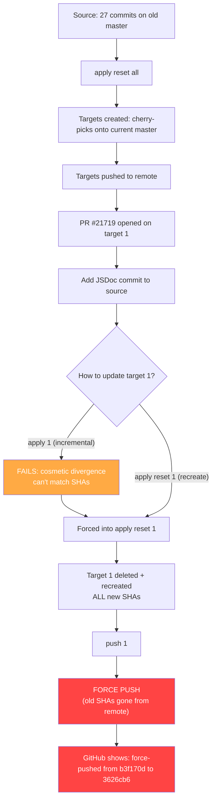
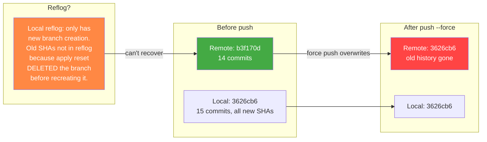
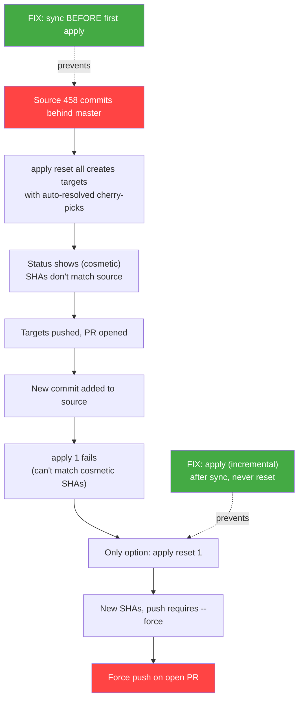
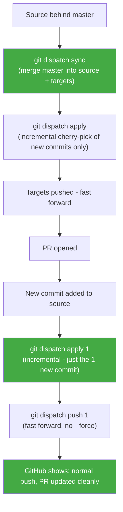

# Pitfall: apply reset force-push trap

## The fatal sequence

## Why it was unrecoverable

## The chain of causation

## What should have happened

## Why the old target was unrecoverable

1. `apply reset 1` ran `git branch -D cyril/dispatch/bulk-transaction-registration/1` (delete)
2. Then recreated it from `origin/master` with fresh cherry-picks (all new SHAs)
3. The branch deletion cleared the local reflog for that branch
4. `git push` sent the new SHAs to remote, overwriting the old history
5. The old commit `b3f170d` exists nowhere: not in local reflog, not on remote

The only theoretical recovery would be GitHub's internal reflog (support request) or if someone had fetched the old branch before the force push.

## Rules to prevent this

1. **Always `sync` before first `apply`** when source is behind master
2. **Never `apply reset` on pushed targets** unless you accept force-push
3. **Use `apply` (incremental) after sync** to add new commits
4. **Reserve `apply reset` for truly broken targets** that have never been pushed, or where force-push is acceptable
